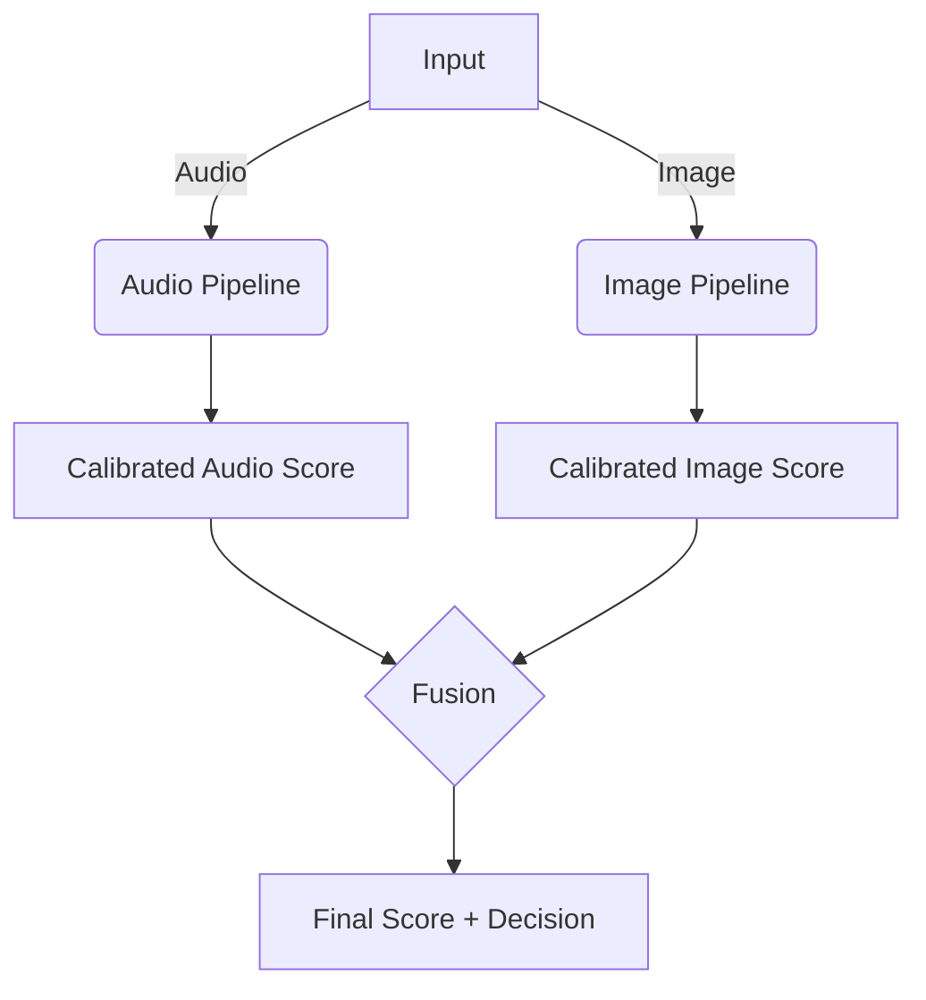

#run the web application

powershell -ExecutionPolicy Bypass -File run_webapp.ps1


# DeepFake Detection (Audio + Image)

Low-GPU, high-accuracy multimodal deepfake detection with simple CLI. Targets:
- Audio: ≥ 94% accuracy
- Image: ≥ 91% accuracy
- Minimize EER/FAR/FRR, real-time inference, ≤ RTX-2060/iGPU

## Architecture Overview



### Audio Pipeline
- SpecRNet-Lite (≤ ~3M params) with learnable filterbanks
- Multi-resolution spectrogram fusion + raw waveform branch (hybrid)
- Optional frozen feature extractors: wav2vec2/Whisper-small encoder
- Enhancements: SpecAugment++, supervised contrastive + focal loss, hard negatives

### Image Pipeline
- ViT-Tiny/Small or DeiT-Small (distilled) via timm; EfficientNet-V2-S fallback
- Patch size 8×8 for subtle artifacts; dual branch RGB + frequency (FFT/DCT)
- Teacher–student self-distillation; landmark-aware face-cropping
- Adversarial JPEG/compression noise robustness

### Fusion & Calibration
- Late fusion: `final = α·audio + β·image`, α+β=1, α>β for voice attacks
- Cross-modal inconsistency scoring
- Temperature scaling + Bayesian calibration

## Hyperparameters (Defaults)

See configs/hparams.yaml for a complete, editable table.

Key training choices:
- Optimizer: AdamW; Scheduler: Cosine annealing w/ warmup
- Mixed precision (FP16); Quantization-aware training ready (INT8)
- Early stopping patience=5; checkpoint by best EER

## Metrics (Formulas)
- Accuracy = (TP+TN)/(TP+TN+FP+FN)
- Precision = TP/(TP+FP)
- Recall = TP/(TP+FN)
- F1 = 2·Precision·Recall/(Precision+Recall)
- ROC-AUC = ∫ TPR(FPR) dFPR
- FAR = FP/(FP+TN)
- FRR = FN/(FN+TP)
- EER: threshold τ where FAR(τ) = FRR(τ)
- Latency: mean wall-clock per sample (ms)
- GPU memory: peak allocated during inference (MB)

## CLI

Audio:
```bash
python detect.py --audio samples/voice.wav
```
Image:
```bash
python detect.py --image samples/face.jpg
```
Multimodal:
```bash
python detect.py --audio samples/voice.wav --image samples/face.jpg
```

Outputs include: prediction, confidence, FAR/FRR or Precision/Recall where applicable, inference time.

## Expected Performance vs SecureVision (Sensors 2024)
- Audio: ≥ 94–96% accuracy, EER ≤ 4–6% with contrastive pretraining + SpecAugment++ and fusion of learnable filterbanks with pretrained encoders.
- Image: ≥ 91–93% accuracy, EER ≤ 7–9% with dual RGB+frequency and 8×8 ViT/DeiT-S distillation.
- Advantages: Better calibration (temperature scaling), robust to compression, efficient models suitable for RTX-2060/iGPU.

## Deployment Notes
- CPU/iGPU: Enable `--device cpu` and `--precision fp16` where supported; ORT runtime for ONNX if needed.
- RTX-2060: Batch=1, mixed precision on; expect ~15–40 ms inference/sample.
- Quantization: Use QAT hooks during training; export to INT8 for edge.

## Data Layout (Example)
```
./data/
  audio/
    train/{real,fake}/...wav
    val/{real,fake}/...wav
    test/{real,fake}/...wav
  image/
    train/{real,fake}/...jpg
    val/{real,fake}/...jpg
    test/{real,fake}/...jpg
```

## Train
```bash
# Audio
python -m src.training.train_audio --config configs/hparams.yaml
# Image
python -m src.training.train_image --config configs/hparams.yaml
# Multimodal
python -m src.training.train_multimodal --config configs/hparams.yaml
```

## License
Internal/research use. Replace with your policy.
# Deepfake
