# 🔐 SecureVision – Multimodal DeepFake Detection

## Overview
SecureVision is a **multimodal deepfake detection system** capable of identifying forged **audio**, **images**, or a combination of both using **late fusion**. The system is lightweight, GPU-friendly, configurable, and suitable for **academic projects, research prototypes, and demos**.

**Key features:**
- 🎧 Audio deepfake detection (SpecRNet-Lite)
- 🖼️ Image deepfake detection (SigLIP – Hugging Face)
- 🔗 Late fusion of audio + image scores
- 🌐 Web UI, CLI, and batch evaluation
- ⚙️ Configurable thresholds, fusion weights, and temperature scaling

---

## System Components

### Audio Detection
- **Model:** SpecRNet-Lite
- **Inputs:** Raw waveform
- **Features:**
  - Learnable filterbanks
  - Multi-resolution STFT / Mel spectrograms
  - Raw waveform branch
- **Output:** Probability of FAKE (sigmoid)
- **Checkpoint:**
  ```
  checkpoints/audio_kaggle_best.pt
  ```

---

### Image Detection

#### Primary (Hugging Face)
- **Model:** SigLIP Image Classifier
- **Repository:** prithivMLmods/deepfake-detector-model-v1
- **Threshold:** 0.30
- **Temperature:** 1.0
- **Cache Directory:**
  ```
  checkpoints/pretrained_hf/
  ```

#### Fallback (Local / timm)
- EfficientNet variants
- DeiT variants

---

### Multimodal Fusion
Late fusion combines calibrated audio and image probabilities:

```
final_score = alpha * audio_score + beta * image_score
```

**Default fusion parameters:**
- alpha = 0.6
- beta = 0.4
- inconsistency_weight = 0.1
- optional temperature scaling

---

## Configuration
📄 `configs/hparams.yaml`

```yaml
device: auto
precision: fp16   # fp32 on CPU

audio:
  threshold: 0.50

image:
  threshold: 0.30
  temperature: 1.0

fusion:
  alpha: 0.6
  beta: 0.4
  inconsistency_weight: 0.1
```

---

## How to Run

### Web Application
```powershell
powershell -ExecutionPolicy Bypass -File run_webapp.ps1
```

Open browser:
```
http://localhost:8000
```

---

### CLI – Single Sample

**Audio only**
```bash
python detect.py --audio samples/fake_1.wav
```

**Image only**
```bash
python detect.py --image samples/fake_01.jpg
```

**Multimodal**
```bash
python detect.py --audio samples/fake_1.wav --image samples/fake_01.jpg
```

---

### Batch Evaluation
```bash
python scripts/eval_samples.py
```

**Labeling heuristic:**
- Filenames containing `fake` → FAKE
- Otherwise → REAL

**Outputs:**
- Per-file predictions
- Accuracy per modality

> Fusion accuracy is not computed by default.

---

## Expected Performance (Reported)

| Modality | Accuracy | EER |
|--------|---------|-----|
| Audio  | 94–96%  | 4–6% |
| Image  | 91–93%  | 7–9% |

---

## Dataset Layout

```
samples/
├── audio/
│   ├── fake_1.wav
│   ├── fake_tts_2.wav
│   ├── real_3.wav
│   └── real2.wav
│
└── images/
    ├── fake_01.jpg ... fake_15.jpg
    ├── real_01.jpg ... real_15.jpg
    └── real_web_7.jpg ... real_web_10.jpg
```

---

## Architecture Diagram


---

## Audio Inference Flow

```mermaid
flowchart LR
  W[Waveform] --> F1[Learnable Filterbanks]
  W --> F2[Multi-Resolution Spectrograms]
  F1 --> E[SpecRNet Encoder]
  F2 --> E
  E --> H[Pooling + Dense]
  H --> P[Sigmoid → Fake Probability]
```



---

## Image Inference Flow (SigLIP)


---

## Metrics & Evaluation Pipeline


---

## Checkpoints & Cache

### Hugging Face Cache
```
checkpoints/pretrained_hf/models--prithivMLmods--deepfake-detector-model-v1/
```

Contains:
- config.json
- model.safetensors
- preprocessor_config.json

---

### Local Checkpoints
```
checkpoints/audio_kaggle_best.pt
checkpoints/image_best.pt   # optional
```

---

## Notes & Optimization Tips
- Filename-based labeling may cause noise; refine `_label_from_name()` if needed
- For CPU-only inference:
  ```bash
  --device cpu --precision fp32
  ```
- If CUDA OOM occurs:
  - Reduce image resolution in `configs/hparams.yaml`
  - Switch image backend to timm

---

## Project Status
✔ Multimodal inference
✔ Web + CLI interface
✔ Config-driven pipeline
✔ Academic & research ready

